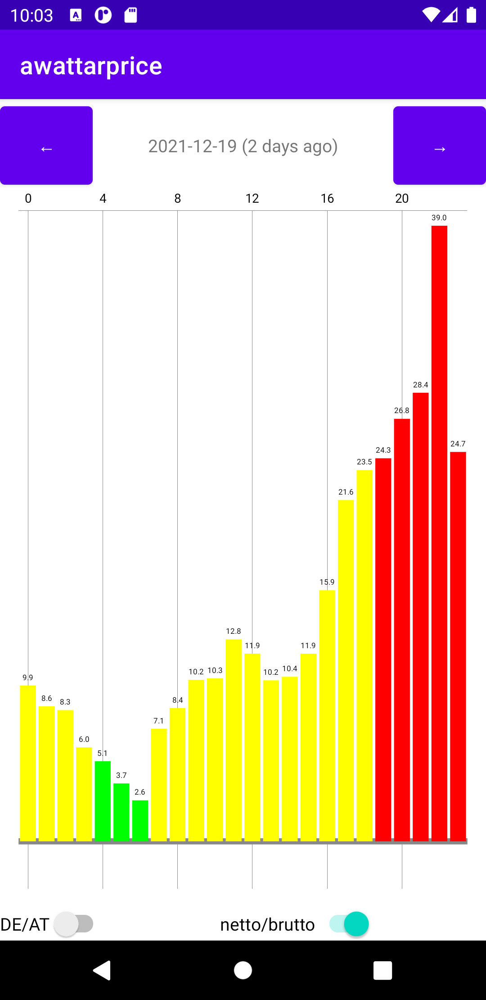

# awattarprice

This is a very simple Android App which displays the daily EPEX spot prices from
the [API](https://awattar.de/services/api) from the electricity supplier 
[aWATTar](https://awattar.de). It works for both Germany and Austria.

Please note that this is my first Java project since 10 years and my first
Android App. I do not actually plan to add new features, too :)

## License & Contribution

I hereby release this code under the conditions of the [MIT license].

Unless you explicitly state otherwise, any contribution intentionally submitted
for inclusion in the work by you shall be licensed with MIT license without any 
additional terms or conditions.
